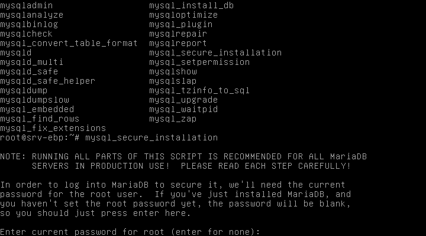

# se3-ebp
utilisation du PGI client-serveur EBP dans un environnement sambaedu


**Article en tout début de rédaction.**

* [Présentation](#présentation)
* [Mise en place du serveur Linux SQL](#mise-en-place-du-serveur-linux-sql)
     * [Installation du système d'exploitation](#installation-du-systeme-d-exploitation)
     * [Installation du moteur SQL](#installation-du-moteur-sql)
     * [Sécurisation du serveur MySQL](#securisation-du-serveur-mysql)
     * [Création d'un utilisateur pouvant lire et écrire dans les bases de données](#creation-d-un-utilisateur-pouvant-lire-et-ecrire-dans-les-bases-de-donnees)


## Présentation
EBP est un logiciel type PGI. Il peut être utilisé de façon collaborative en mode client-serveur.

IL ne sera pas nécéssaire d'utiliser un windows serveur, ou d'activer un nouveau domaine sur le réseau pédagogique.

On installera sur un serveur dédié une ditribution Linux Server (Débian ou Ubuntu) avec un moteur mysql. Ce serveur sera placé dans le réseau pédagogique au même titre que le se3.
Il faudra créer ensuite un compte utilisateur/administrateur de bases mysql. 

Les clients EBP sous  Windows se connecteront au serveur au moyen de raccourcis. Plusieurs élèves pourront ainsi travailler sur une même base de donnée et gérer chacun leur tâche de façon collaborative.

L'upload/suppression de bases EBP pourra se faire avec des outils graphiques sous Windows, rendant la gestion par un professeur non initié à Linux très simple.

## Mise en place du serveur Linux SQL

### Installation du système d'exploitation
L'installation décrite ici a été faite sur une debian server Stretch. Le plus simple est de télécharger l'iso netinstall disponible ici:
https://www.debian.org/CD/netinst/

Sauf serveur très vieux ou particulier, on choisira la version amd64:
https://cdimage.debian.org/debian-cd/current/amd64/iso-cd/debian-9.4.0-amd64-netinst.iso

On gravera le fichier iso téléchargé sur un cd. Il suffira de booter sur le cd et de se laisser guider.


### Installation du moteur SQL
On se connecte en root
```
apt-get install mysql-server
```
Le serveur est maintenant doté d'un moteur mysql. A noter qu'aucun mot de passe n'a été demandé.

### Sécurisation du serveur MySQL
Puisqu'aucun mot de passe n'a été demandé, il faut sécuriser l'accès au serveur en interdisant la connexion distante en root.

On lance la commande:

```
mysql_secure_installation
```

Initialement, il n'y a pas de mdp root pour mysql, on laissera donc la première demande vierge. On indiquera ensuite Y pour mettre un mot de passe solide Mysql




On supprimera ensuite l'utilisateur anonyme en tapant Y pour "remove anonymous users"
--> mysql3
On désactivera ensuite l'accès "root" aux utilisateurs: ainsi, une connection "root" sera possible uniquement sur le serveur, mais impossible avec des outils de gestion MySQL comme phpmyadmin ou MySQL Workbench (sur Windows).

--> mysql3
On supprime également les bases de tests et autres fichiers inutiles.

### Création d'un utilisateur pouvant lire et écrire dans les bases de données
Il faut maintenant créer un nouvel utilisateur de bases mysql, car les enseignants n'auront pas accès au compte root.
```
CREATE USER 'adminmysql'@'localhost' IDENTIFIED BY 'mysql123';
```
L'utilisateur est maintenant créé, il ne reste plus qu'à lui donner des droits de lecteure/écriture sur les bases.

```
GRANT ALL PRIVILEGES ON * . * TO 'adminmysql'@'localhost';
```
Il faut maintenant appliquer les différents changements effectués.
```
FLUSH PRIVILEGES;
```

On pourra évidemment créer plusieurs utilisateurs. Une fois les opérations terminées on peut quitter la console Mysql.

```
exit
```

## Installation des clients EBP.

